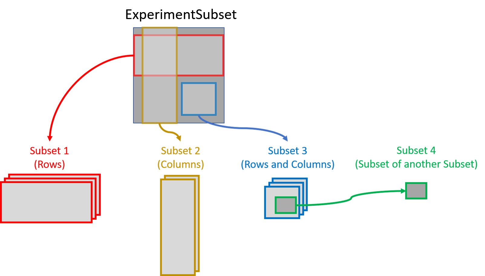

```{r options, include=FALSE, echo=FALSE}
knitr::opts_chunk$set(warning=FALSE, error=FALSE, message=FALSE)
```
# Installation

```{r, eval= FALSE}
if (!requireNamespace("BiocManager", quietly=TRUE)){
    install.packages("BiocManager")}
BiocManager::install("ExperimentSubset")
```

To install the latest version from Github, use the following code:

```{r, eval = FALSE}
library(devtools)
install_github("campbio/ExperimentSubset")
```

Loading the package:

```{r}
library(ExperimentSubset)
```

# Motivation

Experiment objects such as the `SummarizedExperiment` or `SingleCellExperiment`
are data containers for one or more matrix-like assays along with the associated
row and column data. Often only a subset of the original data is needed for 
down-stream analysis. For example, filtering out poor quality samples will 
require excluding some columns before analysis. The `ExperimentSubset` object 
is a container to efficiently manage different subsets of the same data without 
having to make separate objects for each new subset. 

# A Brief Description

`ExperimentSubset` package enables users to perform flexible subsetting of 
Single-Cell data that comes from the same experiment as well as the consequent
storage of these subsets back into the same object. In general, it offers the 
same interface to the users as the `SingleCellExperiment` container which is 
one the most widely used containers for Single-Cell data. However, in addition 
to the features offered by `SingleCellExperiment` container, `ExperimentSubset` 
offers subsetting features while hiding the implementation details from the 
users. It does so by creating references to the subset `rows` and `columns` 
instead of storing a new assay whenever possible. Functions from 
`SingleCellExperiment` such as `assay`, `rowData` and `colData` can be used for 
regular assays as one would normally do, as well as with newly created subsets
of the data. This allows the users to use the `ExperimentSubset` container 
simply as if they were using `SingleCellExperiment` container with no change 
required to the existing code. 

# Overview of the `ExperimentSubset` class

The `ExperimentSubset` class contains two slots, the `root` slot and the
`subsets` slot. The `root` slot is always an experiment object inherited from
`SummarizedExperiment` class, while the `subsets` slot is a `list` of subsets
created from the `root` object.





Each subset inside the `ExperimentSubset` object (more specifically inside the
`subsets` slot of the object) is stored as an `AssaySubset` instance. This 
`AssaySubset` instance creates reference to the row and column indices for this
particular subset against a parent (which can either be the root object or
another subset). In case a new assay is to be stored against a subset, it is 
stored as a separate experiment object (same class as the `root`) inside the 
subset. 

# Core methods of `ExperimentSubset` class

While all the common methods available with `SummarizedExperiment` and
`SingleCellExperiment` classes have been overridden to support the
`ExperimentSubset` class with additional support for subsets, some core methods
for the creation and manipulation of subsets have been provided with the 
`ExperimentSubset` class.

## `ExperimentSubset` constructor

The constructor method allows the creation of an `ExperimentSubset` object from
an input experiment object as long as it is inherited from 
`SummarizedExperiment` class. Additionally, if needed, a subset can be directly
created from within the constructor by providing input a named list to the 
`subset` parameter.

```{r}
counts <- matrix(rpois(100, lambda = 10), ncol=10, nrow=10)
sce <- SingleCellExperiment(list(counts = counts))
es <- ExperimentSubset(sce)
es
```

## `createSubset`

The `createSubset` method as evident from the name, creates a subset from an
already available `assay` in the object. The `subsetName` (a `character` string),
`rowIndices` (a `numeric` or `character` `vector`), `colIndices` (a `numeric` or 
`character` `vector`) and `parentAssay` (a `character` string) are the standard
parameters of the `createSubset` method. If `rowIndices` or `colIndices` are
`missing` or `NULL`, all of the rows or columns are selected from the specified
`parentAssay`. If `parentAssay` is `missing` or `NULL`, the first available
assay from the `root` object is linked as the parent of this subset. The
`parentAssay` can be an `assay` in the `root` object, a subset or an `assay` 
within a subset. 

The method accepts an `ExperimentSubset` object or any object inherited
from `SummarizedExperiment` for immediate conversion and the creation of the
subset through a single function call.

```{r}
es <- createSubset(es, 
                   subsetName = "subset1",
                   rows = c(1:2),
                   cols = c(1:5),
                   parentAssay = "counts")
es
```

## `setSubsetAssay`

The `setSubsetAssay` method should be used when a subset `assay` needs to be stored
either in a previously created subset or a new subset. This is specifically
different from the `createSubset` method which only creates a subset by
referencing to a defined `parentAssay` where the `internalAssay` of the subset
has no assays stored. The `setSubsetAssay` method however, is used to store an
`assay` in this `internalAssay` slot of the subset which in fact is a subset
experiment object of the same class as the `root` object. Additionally, the
`setSubsetAssay` method can be used to directly create a subset and then store an
`assay` inside this subset depending upon the parameters with which the method
is called.

```{r}
subset1Assay <- assay(es, "subset1")
subset1Assay[,] <- subset1Assay[,] + 1
es <- setSubsetAssay(es, 
                  subsetName = "subset1", 
                  inputMatrix = subset1Assay, 
                  subsetAssayName = "subset1Assay")
es
```

The parameters of interest against this method are `subsetName` which specifies
the name of the subset inside which the an input assay should be stored, 
`inputMatrix` which is a matrix-type object to be stored as an assay inside a 
subset specified by the `subsetName` parameter and lastly the `subsetAssayName`
parameter which represents the name of the new assay. If `subsetAssayName` is 
set to `NULL`, a new subset is created and the `inputMatrix` is stored inside
the new subset.

## `subsetSummary`

The `subsetSummary` method displays an overall summary of the 
`ExperimentSubset` object including the assays in the `root` object, the list
of subsets along with the stored assays, reduced dimensions, alt experiments
and other supplementary information that may help the users understand the
current condition of the object. The most important piece of information
displayed by this method is the hierarchical parent-subset link against each
subset in the object.

```{r}
subsetSummary(es)
```

## Additional helper methods

Some additional helper methods are available for the users to use during
certain circumstances such as during iteration of all subsets. These methods
include `subsetNames` that returns a `character` `vector` of all available
subsets, `subsetAssayNames` that returns a `character` `vector` of all available
subsets and the assays within these subsets, `subsetCount` that returns the
count of the subsets, `subsetAssayCount` that returns the total count of the sum
of the subsets and the assays within these subsets, `subsetDim` that returns the
dimensions of a subset and lastly the `subsetParent` method that returns a 
`character` `list` of complete parent hierarchy of a subset.

## Overriden methods for `ExperimentSubset` class

These are the methods that have been overridden from other classes to support
the subset feature of the `ExperimentSubset` objects by introducing an
additional parameter `subsetName` to these methods. These methods can simply
be called on any `ExperimentSubset` object to get or set from the `root` object
or from any subset by passing the optional `subsetName` parameter.

The methods include `assay`, `assay<-`, `rowData`, `rowData<-`, `colData`,
`colData<-`, `metadata`, `metadata<-`, `reducedDim`, `reducedDim<-`, 
`reducedDims`, `reducedDims<-`, `reducedDimNames`, `reducedDimNames<-`,
`altExp`, `altExp<-`, `altExps`, `altExps<-`, `altExpNames`, `altExpNames<-`,
`rownames`, `rownames<-`, `colnames` and `colnames<-`. All of the methods
can be used with the subsets by providing the optional `subsetName` parameter.

# Using the `ExperimentSubset` object: A toy example

Creating the `ExperimentSubset` object is as simple as passing an experiment
object to the `ExperimentSubset` constructor:

```{r}
counts <- matrix(rpois(100, lambda = 10), ncol=10, nrow=10)
sce <- SingleCellExperiment(list(counts = counts))
es <- ExperimentSubset(sce)
subsetSummary(es)
```

Create a subset that includes the first 5 rows and columns only:

```{r}
es <- createSubset(es, 
                   subsetName = "subset1",
                   rows = c(1:5),
                   cols = c(1:5),
                   parentAssay = "counts")
subsetSummary(es)
```

Create another subset from `subset1` by only keeping the first two rows:

```{r}
es <- createSubset(es, 
                   subsetName = "subset2",
                   rows = c(1:2),
                   cols = c(1:5),
                   parentAssay = "subset1")
subsetSummary(es)
```

Get `assay` from `subset2` and update values:

```{r}
subset2Assay <- assay(es, "subset2")
subset2Assay[,] <- subset2Assay[,] + 1
```

Store the updated `assay` back to `subset2` using one of the two approaches:

```{r}
#approach 1
es <- setSubsetAssay(es, 
                  subsetName = "subset2", 
                  inputMatrix = subset2Assay, 
                  subsetAssayName = "subset2Assay_a1")

#approach 2
assay(es, "subset2", subsetAssayName = "subset2Assay_a2") <- subset2Assay
subsetSummary(es)
```

Store an experiment object in the `altExp` slot of `subset2`:

```{r}
altExp(x = es,
       e = "subset2_alt1",
       subsetName = "subset2") <- SingleCellExperiment(assay = list(
         counts = assay(es, "subset2")
       ))
```

Show the current condition of `ExperimentSubset` object:

```{r}
subsetSummary(es)
```


# Using the `ExperimentSubset` object: An example with real single cell RNA-seq data

Installing and loading required packages:
```{r, eval = FALSE}
if (!requireNamespace("BiocManager", quietly = TRUE))
    install.packages("BiocManager")
BiocManager::install(version = "3.11", ask = FALSE)
BiocManager::install(c("TENxPBMCData", "scater", "scran"))
```
```{r, eval = FALSE}
library(ExperimentSubset)
library(TENxPBMCData)
library(scater)
library(scran)
```

Load PBMC4K dataset and create `ExperimentSubset` object:

```{r, eval = FALSE}
tenx_pbmc4k <- TENxPBMCData(dataset = "pbmc4k")
es <- ExperimentSubset(tenx_pbmc4k)
subsetSummary(es)
```

Compute `perCellQCMetrics` on `counts` matrix:

```{r, eval = FALSE}
perCellQCMetrics <- perCellQCMetrics(assay(es, "counts"))
colData(es) <- cbind(colData(es), perCellQCMetrics)
```

Filter cells with low column sum and create a new subset called 'filteredCells':

```{r, eval = FALSE}
filteredCellsIndices <- which(colData(es)$sum > 1500)
es <- createSubset(es, "filteredCells", cols = filteredCellsIndices, parentAssay = "counts")
subsetSummary(es)
```

Normalize 'filteredCells' subset using `scater` library and store it back:

```{r, eval = FALSE}
assay(es, "filteredCells", subsetAssayName = "filteredCellsNormalized") <- normalizeCounts(assay(es, "filteredCells"))
subsetSummary(es)
```

Find highly variable genes from the normalized assay in the previous step using `scran` library against the 'filteredCells' subset only:

```{r, eval = FALSE}
topHVG1000 <- getTopHVGs(modelGeneVar(assay(es, "filteredCellsNormalized")), n = 1000)
es <- createSubset(es, "hvg1000", rows = topHVG1000, parentAssay = "filteredCellsNormalized")
subsetSummary(es)
```

Run 'PCA' on the highly variable genes computed in the last step using `scater` library against the 'filteredCells' subset only:

```{r, eval = FALSE}
reducedDim(es, type = "PCA", subsetName = "hvg1000") <- calculatePCA(assay(es, "hvg1000"))
```

Show the current condition of the `ExperimentSubset` object:

```{r, eval = FALSE}
subsetSummary(es)
```

# Methods for `ExperimentSubset`

1. `ExperimentSubset` constructor
2. `createSubset`
3. `setSubsetAssay`
4. `subsetSummary`
5. `subsetParent`
6. `subsetCount`
7. `subsetAssayCount`
8. `subsetNames`
9. `subsetAssayNames`
10. `subsetDim`
11. `subsetRowData`
12. `subsetColData`
13. `show`
14. `assay`
15. `assay<-`
16. `rowData` 
17. `rowData<-`
18. `colData`
19. `colData<-`
20. `metadata`
21. `metadata<-`
22. `reducedDim`
23. `reducedDim<-`
24. `reducedDims`
25. `reducedDims<-`
26. `reducedDimNames`
27. `reducedDimNames<-`,
28. `altExp`
29. `altExp<-`
30. `altExps`
31. `altExps<-`
32. `altExpNames`
33. `altExpNames<-`
34. `rownames`
35. `rownames<-`
36. `colnames`
37. `colnames<-`

# Implementation Details

The internal structure of an `ExperimentSubset` class is described 
below:

## `root` slot

The `root` slot of an `ExperimentSubset` object must be an experiment object
inherited from `SummarizedExperiment` or `SingleCellExperiment` and acts as the
root or the first immediate parent of any subset that is created initially. The 
`ExperimentSubset`object can be used in a fashion similar to 
`SummarizedExperiment` with all the common methods that have been overridden to
support the manipulation of `ExperimentSubset` objects (with or without subsets)
including `assay`, `rowData` and `colData`. Even though all of these methods 
can be used with either `ExperimentSubset` or other experiment objects directly,
the accessible `root` slot offers a convenient way to manipulate the original
object if required by the user.

## `subsets` slot

The `subsets` slot of the `ExperimentSubset` object is a `list`, where each 
element in this list is an object of an internal `AssaySubset` class. Each
element represents one subset linked to the experiment object in the `root` 
slot. The structure of each subset is described below:

### `subsetName`

A `character` string that represents a user-defined name of the subset.

### `rowIndices`

A `numeric` `vector` that stores the indices of the selected rows in the linked
parent assay within for this subset.

### `colIndices`

A `numeric` `vector` that stores the indices of the selected columns in the 
linked parent assay for this subset.

### `parentAssay`

A `character` string that stores the name of the immediate parent to which the
subset is linked. The `parentAssay` can be an `assay` in the `root` slot of the
`ExperimentSubset` object or any subset or any `internalAssay` of a subset.

### `internalAssay`

The `internalAssay` slot stores an experiment object of same type as the `root`
object but with the dimensions of the subset. The `internalAssay` is initially
an empty experiment object with only dimensions set to enable manipulation, but
can be used to store additional data against a subset such as `assay`, 
`rowData`, `colData`, `reducedDims`, `altExps` and `metadata`.

# Session Information

```{r}
sessionInfo()
```