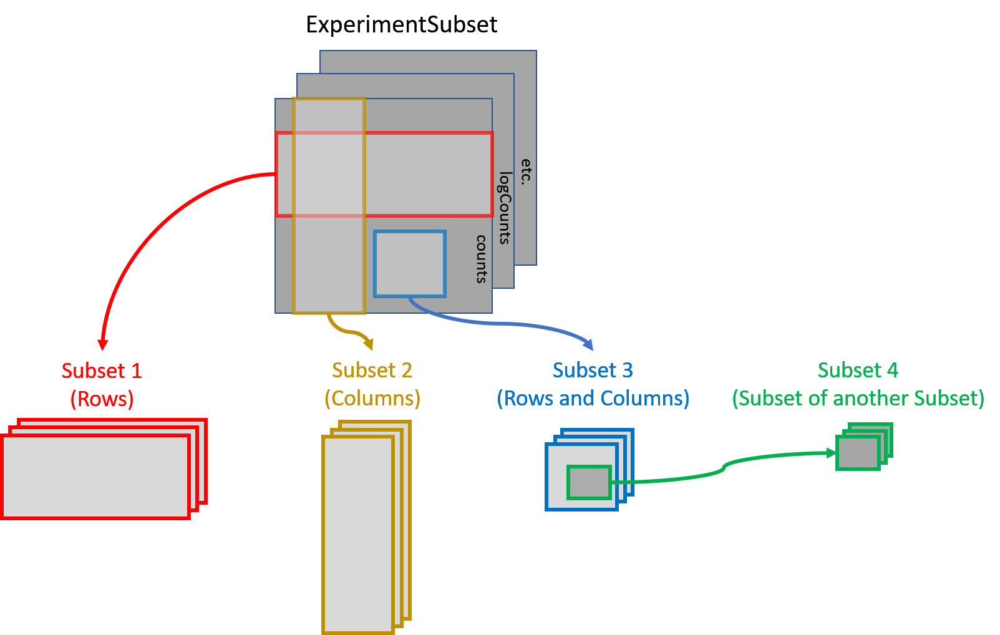

```{r options, include=FALSE, echo=FALSE}
knitr::opts_chunk$set(warning=FALSE, error=FALSE, message=FALSE)
```
# Installation

```{r, eval= FALSE}
if (!requireNamespace("BiocManager", quietly=TRUE)){
    install.packages("BiocManager")}
BiocManager::install("ExperimentSubset")
```

To install the latest version from Github, use the following code:

```{r, eval = FALSE}
library(devtools)
install_github("campbio/ExperimentSubset")
```

Loading the package:

```{r}
library(ExperimentSubset)
```

# Motivation

Experiment objects such as the `SummarizedExperiment` or `SingleCellExperiment`
are data containers for one or more matrix-like assays along with the associated
row and column data. Often only a subset of the original data is needed for 
down-stream analysis. For example, filtering out poor quality samples will 
require excluding some columns before analysis. The `ExperimentSubset` object 
is a container to efficiently manage different subsets of the same data without 
having to make separate objects for each new subset and can be used as a
drop-in replacement for other experiment classes.

# A Brief Description

`ExperimentSubset` package enables users to perform flexible subsetting of 
Single-Cell data that comes from the same experiment as well as the consequent
storage of these subsets back into the same object. In general, it offers the 
same interface to the users as the `SingleCellExperiment` container which is 
one the most widely used containers for Single-Cell data. However, in addition 
to the features offered by `SingleCellExperiment` container, `ExperimentSubset` 
offers subsetting features while hiding the implementation details from the 
users. It does so by creating references to the subset `rows` and `columns` 
instead of storing a new assay whenever possible instead of actually copying
the redundant data. Functions from `SingleCellExperiment` such as `assay`, 
`rowData` and `colData` can be used for regular assays as one would normally do,
as well as with newly created subsets of the data. This allows the users to use 
the `ExperimentSubset` container simply as if they were using 
`SingleCellExperiment` container with no change required to the existing code. 

# Overview of the `ExperimentSubset` class
The `ExperimentSubset` package is composed of multiple classes that support
subsets management capability depending upon the class of the input experiment
object. The currently supported experiment classes which can be used with
`ExperimentSubset` include `SummarizedExperiment`, `RangedSummarizedExperiment`
and `SingleCellExperiment`.

The `ExperimentSubset` package adds an additional slot `subsets` to the objects
from these classes which enables support for the creation and management of 
subsets of data.




Each subset inside the `ExperimentSubset` object (more specifically inside the
`subsets` slot of the object) is stored as an `AssaySubset` instance. This 
`AssaySubset` instance creates reference to the row and column indices for this
particular subset against a parent (which can be the inherited parent object or
another subset). In case a new assay is to be stored against a subset, it is 
stored as a separate experiment object (same class as the inherited object) 
inside the subset. 

# Core methods of `ExperimentSubset` class

While all methods available with `SummarizedExperiment` and
`SingleCellExperiment` classes have been overridden to support the
`ExperimentSubset` class with additional support for subsets, some core methods
for the creation and manipulation of subsets have been provided with the 
`ExperimentSubset` class.

## `ExperimentSubset` constructor

The constructor method allows the creation of an `ExperimentSubset` object from
an input experiment object as long as it is inherited from 
`SummarizedExperiment` class. Additionally, if needed, a subset can be directly
created from within the constructor by providing input a named list to the 
`subset` parameter.

```{r}
counts <- matrix(rpois(100, lambda = 10), ncol=10, nrow=10)
sce <- SingleCellExperiment(list(counts = counts))
es <- ExperimentSubset(sce)
es
```

Additionally, an `ExperimentSubset` object can also be created directly from
generally loaded data such as counts matrices, which can be passed to the
constructor function in a list.

```{r}
counts <- matrix(rpois(100, lambda = 10), ncol=10, nrow=10)
ExperimentSubset(list(counts = counts))
```

## `createSubset`

The `createSubset` method as evident from the name, creates a subset from an
already available `assay` in the object. The `subsetName` (a `character` string),
`rowIndices` (a `numeric` or `character` `vector`), `colIndices` (a `numeric` or 
`character` `vector`) and `parentAssay` (a `character` string) are the standard
parameters of the `createSubset` method. If `rowIndices` or `colIndices` are
`missing` or `NULL`, all of the rows or columns are selected from the specified
`parentAssay`. If `parentAssay` is `missing` or `NULL`, the first available
assay from the parent object is linked as the parent of this subset. The
`parentAssay` can be an `assay` in the parent object, a subset or an `assay` 
within a subset. 

```{r}
es <- createSubset(es, 
                   subsetName = "subset1",
                   rows = c(1:2),
                   cols = c(1:5),
                   parentAssay = "counts")
es
```

## `setSubsetAssay` and `getSubsetAssay`

The `setSubsetAssay` method should be used when a subset `assay` needs to be 
stored either in a previously created subset. This is specifically
different from the `createSubset` method which only creates a subset by
referencing to a defined `parentAssay` where the `internalAssay` of the subset
has no assays stored. The `setSubsetAssay` method however, is used to store an
`assay` in this `internalAssay` slot of the subset which in fact is a subset
experiment object of the same class as the parent object.

```{r}
subset1Assay <- assay(es, "subset1")
subset1Assay[,] <- subset1Assay[,] + 1
es <- setSubsetAssay(es, 
                  subsetName = "subset1", 
                  inputMatrix = subset1Assay, 
                  subsetAssayName = "subset1Assay")
es
```

The parameters of interest against this method are `subsetName` which specifies
the name of the subset inside which the an input assay should be stored, 
`inputMatrix` which is a matrix-type object to be stored as an assay inside a 
subset specified by the `subsetName` parameter and lastly the `subsetAssayName`
parameter which represents the name of the new assay.

To get a subset assay, `getSubsetAssay` method can be used:

```{r}
#get assay from 'subset1'
getSubsetAssay(es, "subset1")

#get internal 'subset1Assay'
getSubsetAssay(es, "subset1Assay")
```

Apart from `setSubsetAssay` and `getSubsetAssay` methods, `assay` and `assay<-`
methods can also be used for the same purpose. Their usage has been described
in the overridden methods section below.

## `subsetSummary`

The `subsetSummary` method displays an overall summary of the 
`ExperimentSubset` object including the assays in the parent object, the list
of subsets along with the stored assays, reduced dimensions, alt experiments
and other supplementary information that may help the users understand the
current condition of the object. The most important piece of information
displayed by this method is the hierarchical 'parent-subset' link against each
subset in the object.

```{r}
subsetSummary(es)
```

## Additional helper methods

Helper methods have been provided for use by the users during specific
circumstances while manipulating subsets of data. These helper methods and 
their short descriptions are given below:

1. `subsetNames` Returns the names of all available subsets (excluding internal subset assays)
2. `subsetAssayNames` Returns the names of all available subsets (including internal subset assays)
3. `subsetCount` Returns the total count of the subsets (excluding internal subset assays)
4. `subsetAssayCount` Returns the total count of the subsets (including internal subset assays)
5. `subsetDim` Returns the dimensions of a specified subset
6. `subsetColData` Gets or sets colData from/to a subset
7. `subsetRowData` Gets or sets rowData from/to a subset
8. `subsetColnames` Gets or sets colnames from/to a subset
9. `subsetRownames` Gets or sets rownames from/to a subset
10. `subsetParent` Returns the 'subset-parent` link of a specified subset
11. `setSubsetAssay` Sets an assay to a subset
12. `getSubsetAssay` Gets an assay from a subset

### subsetColData & subsetRowData

Both `subsetColData` and `subsetrowData` getter methods take in an additional 
logical parameter `parentColData` or `parentRowData` that specifies if the 
returned 'colData' or 'rowData' should include the 'colData' and 'rowData' 
from the parent object as well. By default, `parentColData` and `parentRowData` 
parameters are set to `FALSE`. Same applies to the usage of inherited `rowData` 
and `colData` methods.

```{r}
#store colData to parent object
colData(es) <- cbind(colData(es), sampleID = seq(1:dim(es)[2]))

#store colData to 'subset1' using option 1
colData(es, subsetName = "subset1") <- cbind(
  colData(es, subsetName = "subset1"), 
  subsetSampleID1 = seq(1:subsetDim(es, "subset1")[2]))

#store colData to 'subset1' using option 2
subsetColData(es, "subset1") <- cbind(
  subsetColData(es, "subset1"), 
  subsetSampleID2 = seq(1:subsetDim(es, "subset1")[2]))

#get colData from 'subset1' without parent colData
subsetColData(es, "subset1", parentColData = FALSE)

#get colData from 'subset1' with parent colData
subsetColData(es, "subset1", parentColData = TRUE)

#same applies to `colData` and `rowData` methods when using with subsets
colData(es, subsetName = "subset1", parentColData = FALSE) #without parent data
colData(es, subsetName = "subset1", parentColData = TRUE) #with parent data

```


## Overridden methods for `ExperimentSubset` class

These are the methods that have been overridden from other classes to support
the subset feature of the `ExperimentSubset` objects by introducing an
additional parameter `subsetName` to these methods. These methods can simply
be called on any `ExperimentSubset` object to get or set from the parent object
or from any subset by passing the optional `subsetName` parameter.

The methods include `rowData`, `rowData<-`, `colData`,
`colData<-`, `metadata`, `metadata<-`, `reducedDim`, `reducedDim<-`, 
`reducedDims`, `reducedDims<-`, `reducedDimNames`, `reducedDimNames<-`,
`altExp`, `altExp<-`, `altExps`, `altExps<-`, `altExpNames` and `altExpNames<-`.
All of the methods can be used with the subsets by providing the optional 
`subsetName` parameter.

### assay-get & assay-set inherited methods
An exception to the above approach is the use of `assay` and `assay<-` methods,
both of which have a slightly different usage as described below: 

Because the `assay<-` setter method in the case of a subset needs to store the 
assay inside the subset, we need to specify the subset name inside which the
assay should be stored as `i` parameter and define the new name of the subset
assay as the additional `subsetAssayName` parameter.

```{r}
#creating a dummy ES object
counts <- matrix(rpois(100, lambda = 10), ncol=10, nrow=10)
sce <- SingleCellExperiment(list(counts = counts))
es <- ExperimentSubset(sce)

#create a subset
es <- createSubset(es, subsetName = "subset1", rows = c(1:2), cols = c(1:4))

#store an assay inside the newly created 'subset1'
#note that 'assay<-' setter has two important parameters 'x' and 'i' where
#'x' is the object and 'i' is the assay name, but in the case of storing to a
#subset we use 'x' as the object, 'i' as the subset name inside which the assay
#should be stored and an additional 'subsetAssayName' parameter which defines
#the name of the new assay
assay(
  x = es, 
  i = "subset1", 
  subsetAssayName = "subset1InternalAssay") <- matrix(rpois(100, lambda = 10), 
                                                      ncol=4, nrow=2)
```

Using `assay` getter method is simple, as no additional parameter is required
unlike in the setter method. 

```{r}
#assay getter has parameters 'x' which is the input object, 'i' which can either
#be a assay name in the parent object, a subset name or a subset assay name

#getting 'counts' from parent es object
assay(
  x = es,
  i = "counts"
)

#getting just the 'subset1' from es object
assay(
  x = es,
  i = "subset1"
)

#getting the 'subset1InternalAssay' from inside the 'subset1'
assay(
  x = es,
  i = "subset1InternalAssay"
)
```

# Using the `ExperimentSubset` object: A toy example

Creating the `ExperimentSubset` object is as simple as passing an experiment
object to the `ExperimentSubset` constructor:

```{r}
counts <- matrix(rpois(100, lambda = 10), ncol=10, nrow=10)
sce <- SingleCellExperiment(list(counts = counts))
es <- ExperimentSubset(sce)
subsetSummary(es)
```

Create a subset that includes the first 5 rows and columns only:

```{r}
es <- createSubset(es, 
                   subsetName = "subset1",
                   rows = c(1:5),
                   cols = c(1:5),
                   parentAssay = "counts")
subsetSummary(es)
```

Create another subset from `subset1` by only keeping the first two rows:

```{r}
es <- createSubset(es, 
                   subsetName = "subset2",
                   rows = c(1:2),
                   cols = c(1:5),
                   parentAssay = "subset1")
subsetSummary(es)
```

Get `assay` from `subset2` and update values:

```{r}
subset2Assay <- assay(es, "subset2")
subset2Assay[,] <- subset2Assay[,] + 1
```

Store the updated `assay` back to `subset2` using one of the two approaches:

```{r}
#approach 1
es <- setSubsetAssay(es, 
                  subsetName = "subset2", 
                  inputMatrix = subset2Assay, 
                  subsetAssayName = "subset2Assay_a1")

#approach 2
assay(es, "subset2", subsetAssayName = "subset2Assay_a2") <- subset2Assay
subsetSummary(es)
```

Store an experiment object in the `altExp` slot of `subset2`:

```{r}
altExp(x = es,
       e = "subset2_alt1",
       subsetName = "subset2") <- SingleCellExperiment(assay = list(
         counts = assay(es, "subset2")
       ))
```

Show the current condition of `ExperimentSubset` object:

```{r}
subsetSummary(es)
```


# Using the `ExperimentSubset` object: An example with real single cell RNA-seq data

Installing and loading required packages:
```{r, eval = FALSE}
if (!requireNamespace("BiocManager", quietly = TRUE))
    install.packages("BiocManager")
BiocManager::install(version = "3.11", ask = FALSE)
BiocManager::install(c("TENxPBMCData", "scater", "scran"))
```
```{r, eval = FALSE}
library(ExperimentSubset)
library(TENxPBMCData)
library(scater)
library(scran)
```

Load PBMC4K dataset and create `ExperimentSubset` object:

```{r, eval = FALSE}
tenx_pbmc4k <- TENxPBMCData(dataset = "pbmc4k")
es <- ExperimentSubset(tenx_pbmc4k)
subsetSummary(es)
```

Compute `perCellQCMetrics` on `counts` matrix:

```{r, eval = FALSE}
perCellQCMetrics <- perCellQCMetrics(assay(es, "counts"))
colData(es) <- cbind(colData(es), perCellQCMetrics)
```

Filter cells with low column sum and create a new subset called 'filteredCells':

```{r, eval = FALSE}
filteredCellsIndices <- which(colData(es)$sum > 1500)
es <- createSubset(es, "filteredCells", cols = filteredCellsIndices, parentAssay = "counts")
subsetSummary(es)
```

Normalize 'filteredCells' subset using `scater` library and store it back:

```{r, eval = FALSE}
assay(es, "filteredCells", subsetAssayName = "filteredCellsNormalized") <- normalizeCounts(assay(es, "filteredCells"))
subsetSummary(es)
```

Find highly variable genes from the normalized assay in the previous step using `scran` library against the 'filteredCells' subset only:

```{r, eval = FALSE}
topHVG1000 <- getTopHVGs(modelGeneVar(assay(es, "filteredCellsNormalized")), n = 1000)
es <- createSubset(es, "hvg1000", rows = topHVG1000, parentAssay = "filteredCellsNormalized")
subsetSummary(es)
```

Run 'PCA' on the highly variable genes computed in the last step using `scater` library against the 'filteredCells' subset only:

```{r, eval = FALSE}
reducedDim(es, type = "PCA", subsetName = "hvg1000") <- calculatePCA(assay(es, "hvg1000"))
```

Show the current condition of the `ExperimentSubset` object:

```{r, eval = FALSE}
subsetSummary(es)
```

# Methods for `ExperimentSubset`

1. `ExperimentSubset` constructor
2. `createSubset`
3. `setSubsetAssay`
4. `getSubsetAssay`
5. `subsetSummary`
6. `subsetParent`
7. `subsetCount`
8. `subsetAssayCount`
9. `subsetNames`
10. `subsetAssayNames`
11. `subsetDim`
12. `subsetRowData`
13. `subsetColData`
14. `subsetColnames`
15. `subsetRownames`
16. `subsetRowData<-`
17. `subsetColData<-`
18. `subsetColnames<-`
19. `subsetRownames<-`
20. `show`
21. `assay`
22. `assay<-`
23. `rowData` 
24. `rowData<-`
25. `colData`
26. `colData<-`
27. `metadata`
28. `metadata<-`
29. `reducedDim`
30. `reducedDim<-`
31. `reducedDims`
32. `reducedDims<-`
33. `reducedDimNames`
34. `reducedDimNames<-`
35. `altExp`
36. `altExp<-`
37. `altExps`
38. `altExps<-`
39. `altExpNames`
40. `altExpNames<-`

# Implementation Details

The internal structure of an `ExperimentSubset` class is described 
below:

## Inherited parent object

The `ExperimentSubset` object during creation is assigned one of the classes
from `SubsetSummarizedExperiment`, `SubsetRangedSummarizedExperiment` or
`SubsetSingleCellExperiment` which inherit from the class of the input object.
This ensures that `ExperimentSubset` object can be manipulated in a fashion
similar to the input object class and so can be used as a drop-in replacement
for these classes. All methods that are compatible with the input object class
are compatible with the `ExperimentSubset` objects as well.

## Additional `subsets` slot

The `subsets` slot of the `ExperimentSubset` object is a `SimpleList`, where 
each element in this list is an object of an internal `AssaySubset` class. 
The slot itself is not directly accessible to the users and should be accessed
through the provided methods of the `ExperimentSubset` package. Each element 
represents one subset linked to the experiment object in the parent object. 
The structure of each subset is described below:

### `subsetName`

A `character` string that represents a user-defined name of the subset.

### `rowIndices`

A `numeric` `vector` that stores the indices of the selected rows in the linked
parent assay within for this subset.

### `colIndices`

A `numeric` `vector` that stores the indices of the selected columns in the 
linked parent assay for this subset.

### `parentAssay`

A `character` string that stores the name of the immediate parent to which the
subset is linked. The `parentAssay` can be an `assay` in the parent
`ExperimentSubset` object or any subset or any `internalAssay` of a subset.

### `internalAssay`

The `internalAssay` slot stores an experiment object of same type as the input
object but with the dimensions of the subset. The `internalAssay` is initially
an empty experiment object with only dimensions set to enable manipulation, but
can be used to store additional data against a subset such as `assay`, 
`rowData`, `colData`, `reducedDims`, `altExps` and `metadata`.

# Session Information

```{r}
sessionInfo()
```